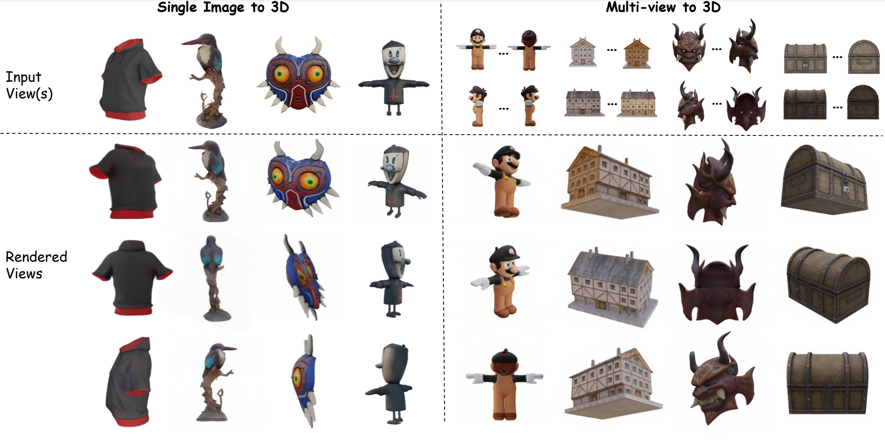

# <div align="center">

# Multi-View Large Reconstruction Model via Geometry-Aware Positional Encoding and Attention

<p align="center">
<a href="https://arxiv.org/abs/2406.07648"></a>
<a href="https://murphylmf.github.io/M-LRM/"></a>
</p>

</div>



---

## News
- [3/12/2024] The inference code and checkpoint is released!
- [19/11/2024] Our code is going to be released in 1-2 weeks. See you then!

## Installation
```sh
git clone https://github.com/murphylmf/M-LRM.git
cd M-LRM

conda create -n mlrm python=3.9
conda activate mlrm

# Install pytorch and choose suitable cuda version. We use cuda12.1 here.
pip install torch==2.4.1 torchvision==0.19.1 torchaudio==2.4.1 --index-url https://download.pytorch.org/whl/cu121

# Install other required packages
pip install -r requirements.txt

# Install torchmcubes for mesh extraction
pip install git+https://github.com/tatsy/torchmcubes.git

```

## Download the Checkpoint
Our trained base version is available at [Google Drive](https://drive.google.com/file/d/1mbneO6l903cUL_gOh8f8xLKW5vVE194x/view?usp=sharing).

Please download the checkpoint and place it in the `ckpts` folder.

## Inference
We provide a script to run the inference with single view input. The script will generate the video and mesh. 

```sh
python infer.py --config configs/mlrm.yaml --refined_mv_model --input examples/bird.png
```

## Acknowledgements
- This project is supported by HKUST and HKGAI.
- We would like to thank [TripoSR](https://github.com/VAST-AI-Research/TripoSR) and [TriplaneGaussian](https://github.com/VAST-AI-Research/TriplaneGaussian) for their great works. Our code is based on their implementations.
- We use [Zero123++](https://github.com/SUDO-AI-3D/zero123plus) as our multi-view generation model. Further more, a finetuned version provided by [InstantMesh](https://github.com/TencentARC/InstantMesh) is helpful for improving the generation quality.

## Citation
If you find this work helpful, please consider citing our paper:
```bibtex
@article{li2024multiview,
  title={Multi-View Large Reconstruction Model via Geometry-Aware Positional Encoding and Attention}, 
  author={Mengfei Li and Xiaoxiao Long and Yixun Liang and Weiyu Li and Yuan Liu and Peng Li and Wenhan Luo and Wenping Wang and Yike Guo},
  journal={arXiv preprint arXiv:2406.07648},
  year={2024}
}
```